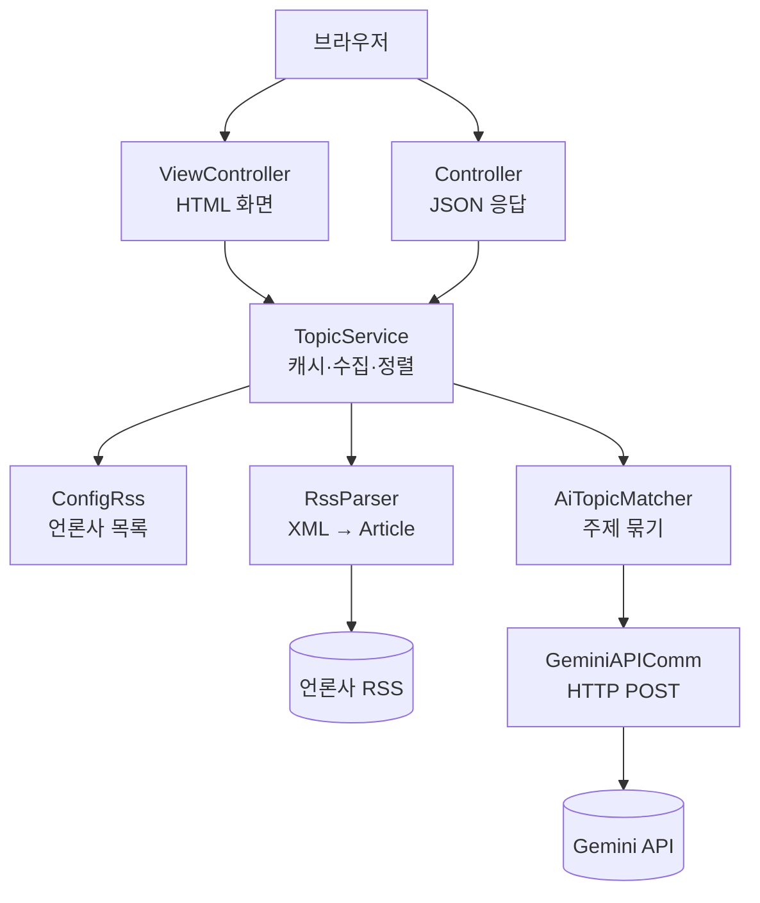
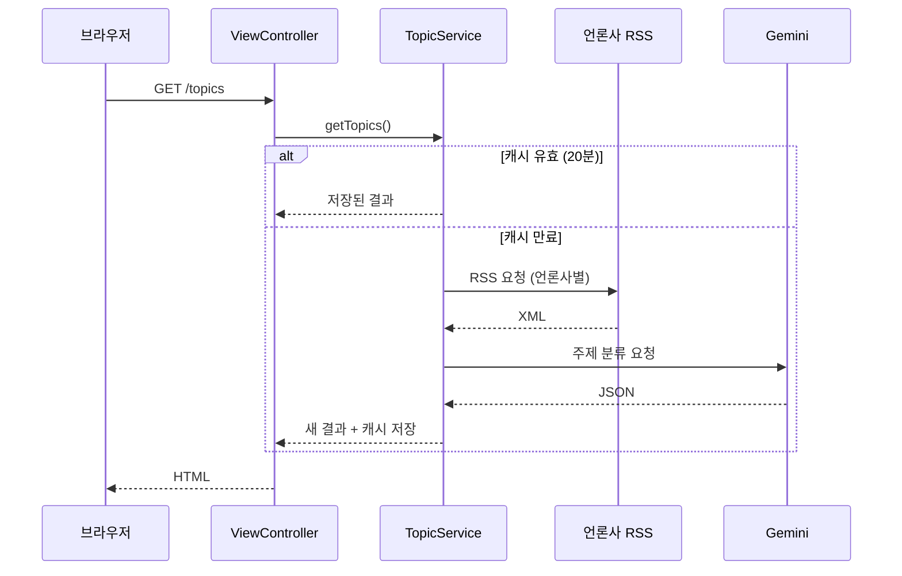

## 아키텍처

```mermaid
graph TD
    B[브라우저] --> VC[ViewController<br/>HTML 화면]
    B --> C[Controller<br/>JSON 응답]
    VC --> TS[TopicService<br/>캐시·수집·정렬]
    C --> TS
    TS --> CR[ConfigRss<br/>언론사 목록]
    TS --> RP[RssParser<br/>XML → Article]
    TS --> AT[AiTopicMatcher<br/>주제 묶기]
    RP --> RSS[(언론사 RSS)]
    AT --> GC[GeminiAPIComm<br/>HTTP POST]
    GC --> GM[(Gemini API)]
```

## 요청 처리 순서

```mermaid
sequenceDiagram
    participant B as 브라우저
    participant VC as ViewController
    participant TS as TopicService
    participant R as 언론사 RSS
    participant G as Gemini

    B->>VC: GET /topics
    VC->>TS: getTopics()
    alt 캐시 유효 (20분)
        TS-->>VC: 저장된 결과
    else 캐시 만료
        TS->>R: RSS 요청 (언론사별)
        R-->>TS: XML
        TS->>G: 주제 분류 요청
        G-->>TS: JSON
        TS-->>VC: 새 결과 + 캐시 저장
    end
    VC-->>B: HTML
```